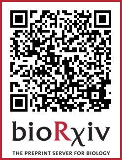
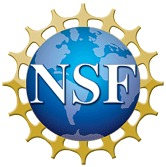

### Computational Biology Education at Auburn University

Jamie Oaks

[@jamoaks](https://twitter.com/jamoaks) | [phyletica.org](http://phyletica.org) | GitHub: [joaks1](https://github.com/joaks1)

[Les Goertzen](http://www.auburn.edu/academic/cosam/faculty/biology/goertzen/),
[Ken Halanych](http://metazoan.auburn.edu/halanych/lab/),
and
[Scott Santos](http://webhome.auburn.edu/~santosr/)

<http://phyletica.org/slides/ievobio-2019>

## Scripting for Biologists
(co-taught with [Scott Santos](http://webhome.auburn.edu/~santosr/))

### Learners
-   Biology graduate students
-   Required part of a Bioinformatics Certificate

### Content
-   Bash and Python scripting with version-control (Git) up front

### Delivery
-   All students get a free, temporary account on the Alabama Super Computer (ASC)

-   Combination of interactive slides followed by a "test-driven exercise"\*\*

\*\*I stole this idea from
[this exercise](https://github.com/mtholder/swc-tree-support-ex)
by
[Mark Holder](http://phylo.bio.ku.edu/content/mark-t-holder)

Example slides:
-   <http://phyletica.org/slides/git-intro>
-   <http://phyletica.org/slides/python/intro>

Example TD exercises:
-   <https://github.com/joaks1/au-bootcamp-git-intro>
-   <https://github.com/joaks1/python-translation-project>

## Bioinformatics Bootcamp
([Scott Santos](http://webhome.auburn.edu/~santosr/),
[Ken Halanych](http://metazoan.auburn.edu/halanych/lab/),
[Les Goertzen](http://www.auburn.edu/academic/cosam/faculty/biology/goertzen/))

### Learners
-   Undergrad & grad students and postdocs from around the world

### Content
-   Crash course in biological computing, mostly geared toward high-throughput
    sequence data
-   My modules focus on
    -   Reproducibility in science via version control
    -   Basic Bash scripting and best practices

### Delivery
-   All participants get a free, temporary account on the ASC
-   Almost everything is done on the command line, logged into the ASC

## Computational Biology REU
(NSF award to
[Les Goertzen](http://www.auburn.edu/academic/cosam/faculty/biology/goertzen/))

### Shameless plug

Preprint by REU student, Nadia L'Bahy:

<a href="https://www.biorxiv.org/content/10.1101/679878v1">
<small>Insights from a general, full-likelihood Bayesian approach to inferring shared
evolutionary events from genomic data: Inferring shared demographic events is
challenging</small>
</a>

### Learners
-   Undergraduate students from diverse backgrounds

### Content
-   Very diverse (mentor/mentee dependent)
-   All students participate in Bioinformatics Bootcamp

### Delivery
-   It varies, but all students get a free, temporary account on the ASC
-   REU students also receive a Raspberry Pi Zero

### Raspberry Pi: First session

<ul>
	<li class="fragment fade-up">
        Unboxing
    </li>
	<li class="fragment fade-up">
        Burn Raspbian to microSD and install on Pi
    </li>
	<li class="fragment fade-up">
        SSH to pi via USB cable and play around
    </li>
	<li class="fragment fade-up">
        We demo how to run the pi like a desktop (using monitor and keyboard)
    </li>
</ul>

    Subsequent sessions focus on scripting and bioinformatics exercises

### Benefits of Pi:

<ul>
	<li class="fragment fade-up">
        Makes what they are doing on the ASC much less abstract
    </li>
	<li class="fragment fade-up">
        Students get to keep it
    </li>
    <ul>
	    <li class="fragment fade-up">
            Enables life-long learners
        </li>
    </ul>
</ul>

### Weaknesses of Pi:

<ul>
	<li class="fragment fade-up">
        Takes time to set up   
    </li>
    <ul>
	    <li class="fragment fade-up">
            But, if you do this with the students, they can learn a lot!
        </li>
    </ul>
	<li class="fragment fade-up">
        Need other equipment to access
    </li>
    <ul>
	    <li class="fragment fade-up">
            We mainly SSH from a laptop
        </li>
	    <li class="fragment fade-up">
            Other option: Keyboard, mouse, and screen
        </li>
        <ul>
	        <li class="fragment fade-up">
                This can be cheap and re-used
            </li>
        </ul>
    </ul>
	<li class="fragment fade-up">
        Limited computational power
    </li>
</ul>

## [Alabama Prison Arts + Education Project](http://apaep.auburn.edu/)
([Kyes Stevens](http://apaep.auburn.edu/staff/))

### Learners
<ul>
    <li class="fragment fade-up">
        Students of all ages from diverse backgrounds
    </li>
    <li class="fragment fade-up">
        Best students ever!
    </li>
</ul>

### Content
-   So far, Evolutionary Biology, and Evolutionary Botany (with Wayne Barger)
-   Want to introduce more STEM, especially computing

### Delivery
-   So far, slides, whiteboard, and exercises
-   Working on plans/permission/funding for Raspberry Pis or Chromebooks, on
    which everything can be done locally

## Acknowledgments

### Support

The version-control and scripting modules, REU, and prison education were
supported by NSF award DEB 1656004 to [Jamie Oaks](http://phyletica.org).

AU Comp Bio REU supported by NSF award DBI 1560115 to [Les Goertzen](http://www.auburn.edu/academic/cosam/faculty/biology/goertzen/)
