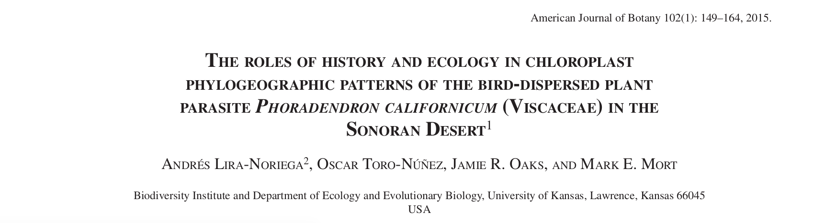
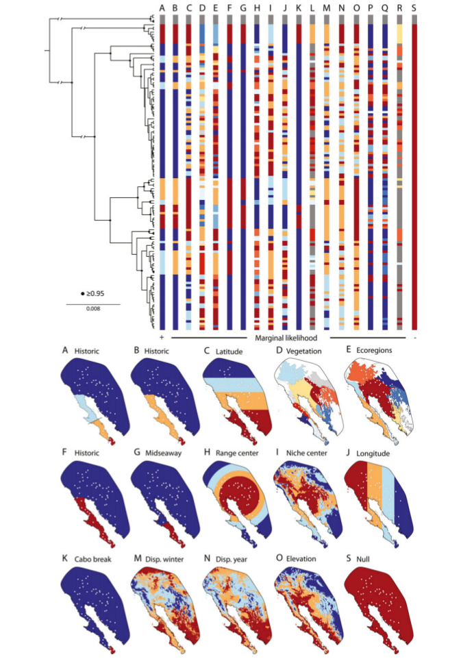
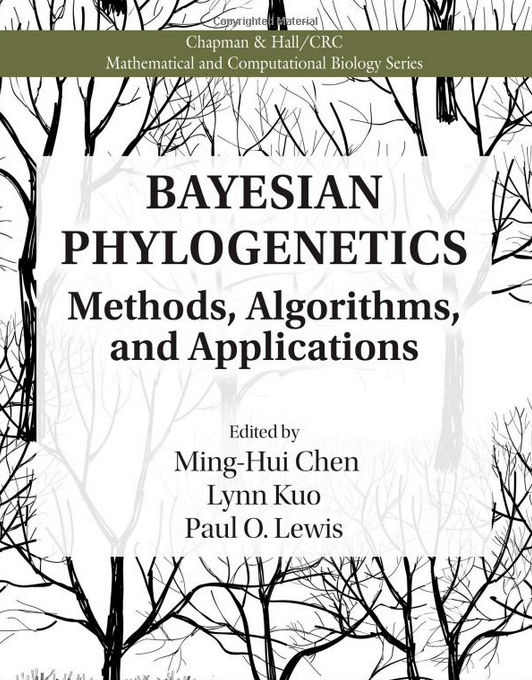
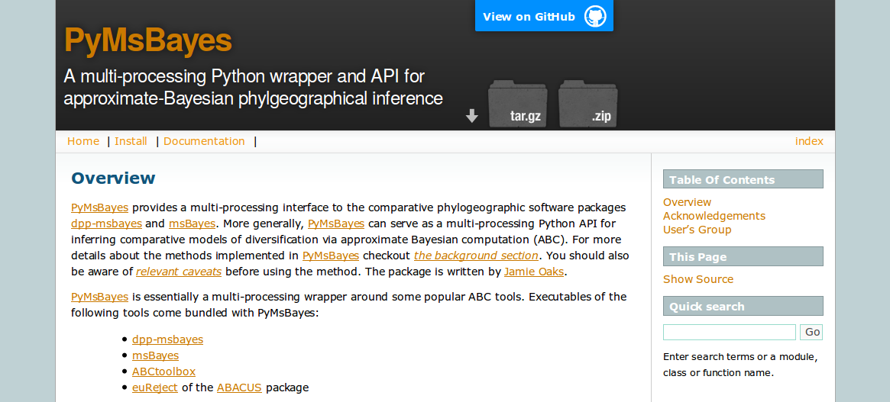
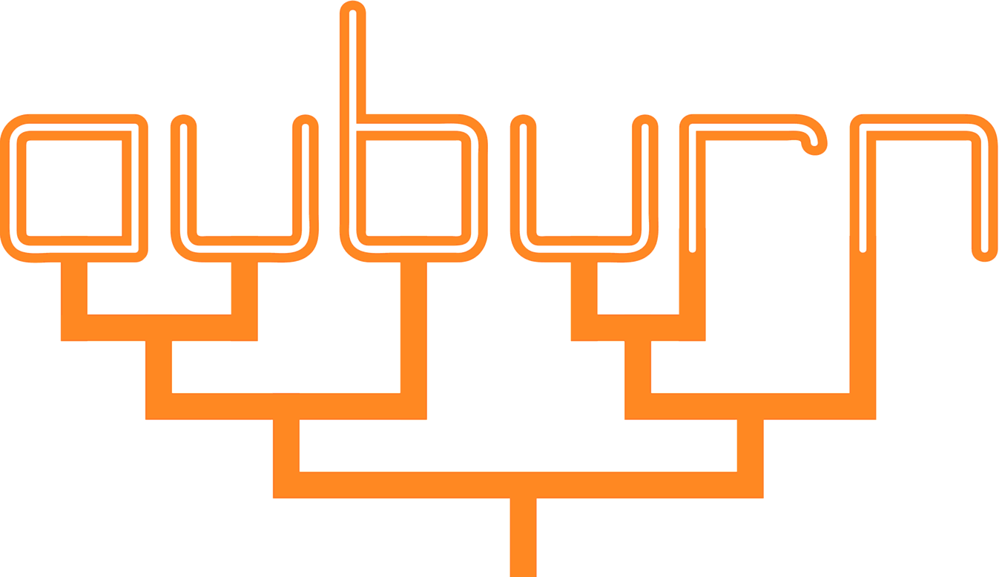
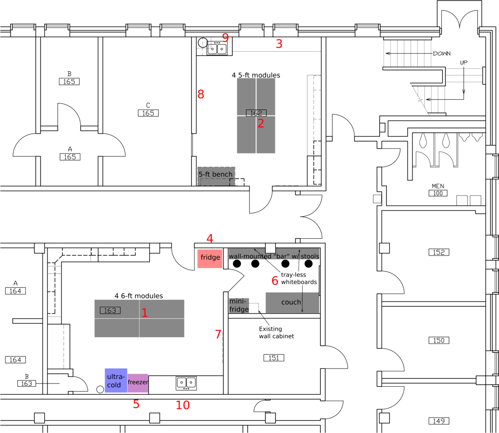
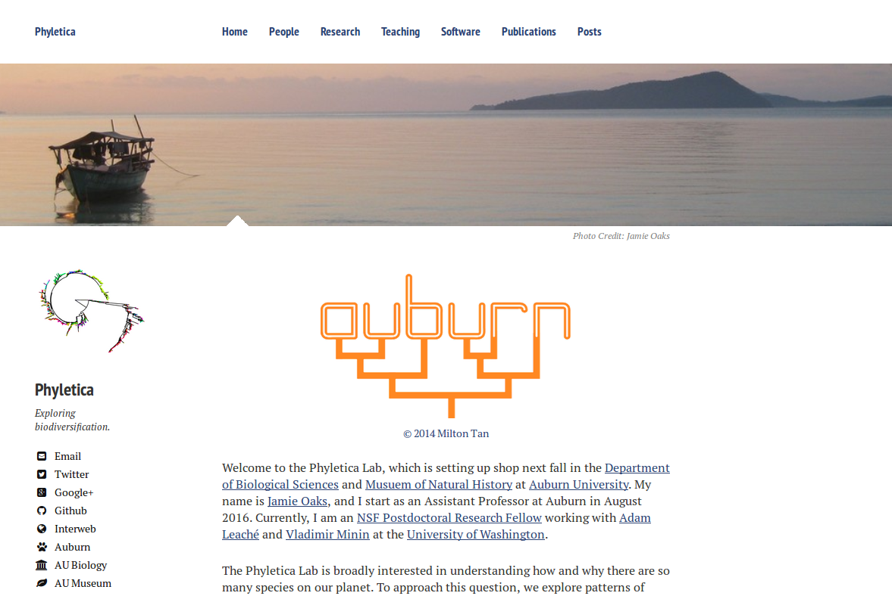
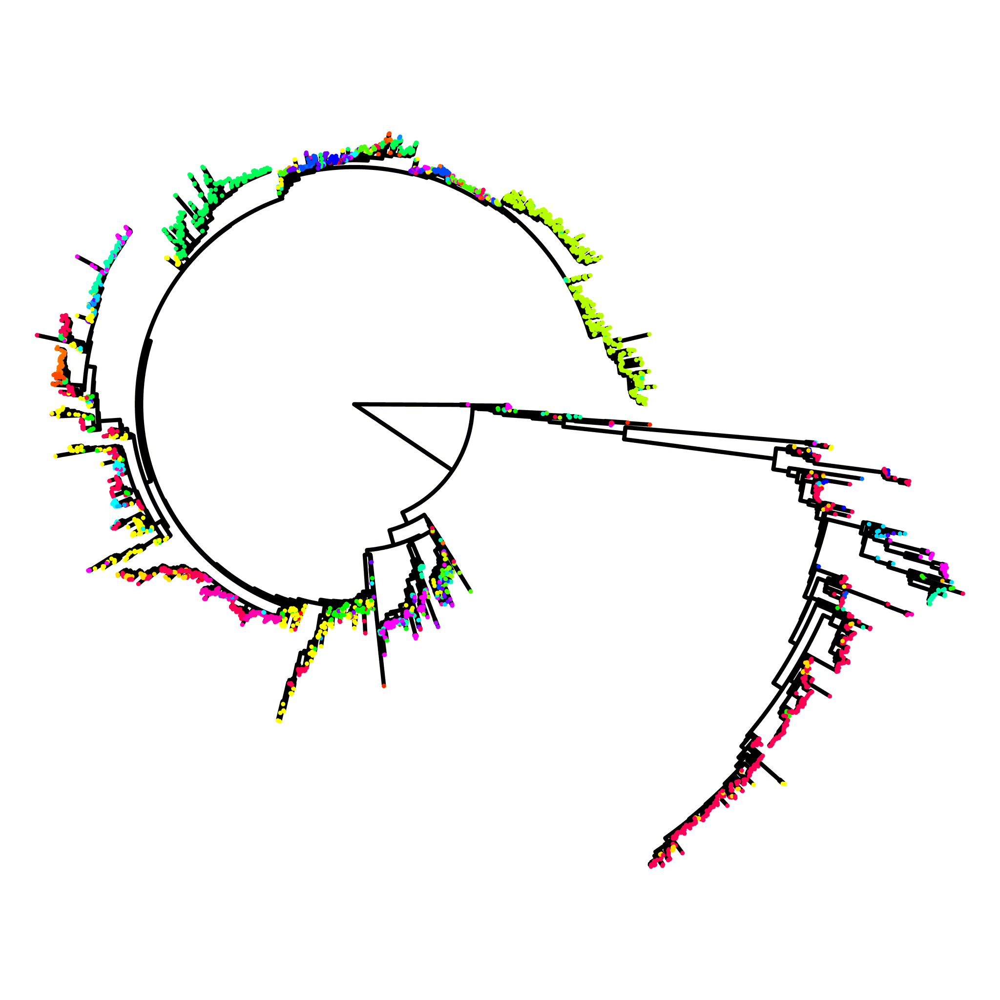

## Accomplishments

## Plans

### Full-likelihood method

-   Need to start implementing full-likelihood inference of shared divergences
    -   Model biallelic data
    -   Analytically integrate over gene trees

-   Talk to Jeet about multi-locus sequence method
    -   It exists, but not published
    -   Numerical integration of gene trees is inefficient

### Fully phylogenetic method

-   Sketch up theory/algorithm for generalized tree prior to accommodate shared divergences
-   Run by revbayes developers
-   Consider including in NSF pre-proposal for January

### Influenza project

-   Do ecological traits structure the flu tree?
-   Parametric bootstrapping approach?
-   GoLife proposal? (March)

### Travel to Oklahoma

-   Give seminar at OU October 21
-   Work with Cam on NSF pre-proposal
    -   Phylogenetic Systematics Program (Southeast Asian Biogeography)
    -   Possibly include development of generalized tree prior

### Student recruitment (!!)

-   Currently ~6 interested
-   Need to plan trip to Auburn in Jan/Feb to host student visits

### Gobi Desert Fieldwork?

-   Possible trip next Spring/Summer

## The project graveyard

### Gecko genomics

-   Need to reassemble genomes
-   Should have access to large memory node soon

### Time-for-speciation in the Philippines

-   Languishing dissertation chapter that needs re-analyses

### Others

-   Cell-masking method
-   *A priori* versus DPP partitioning with croc dataset
